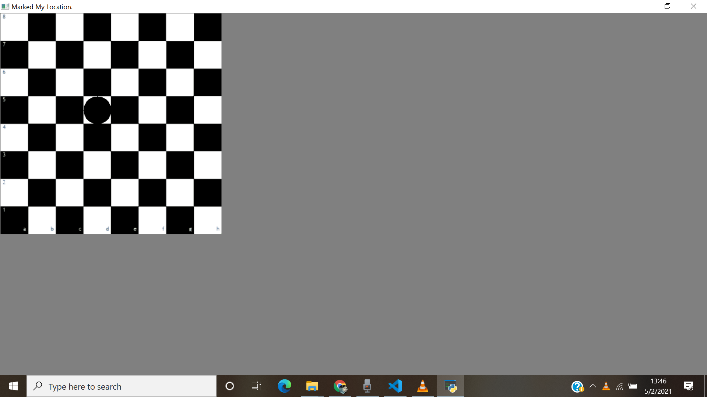
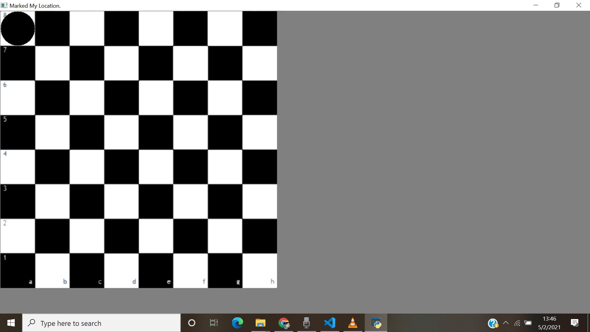

# Mark your Territory
 
 ## Requirements
 > Python3  
 > opencv  
 > numpy

  ### Description
Class containing different functions for each
image operation that needs to be done (example resizing, drawing, displaying, etc) is written in script myLibrary.py

The main flow for input/output will be managed in main.py which will
include the following:

The class object constructed using the image path.  
● Inputting parameters to resize eg. 400 will resize it to 400x400  
● Inputting position on the board to be marked with a solid circle (eg. e4)  
● Displaying output image with the marked square.

## For size = 400x400 and Code = d5

  
## For size = 600x600 and Code = a8

  
# For Demo  
Execute python main.py in terminal.

